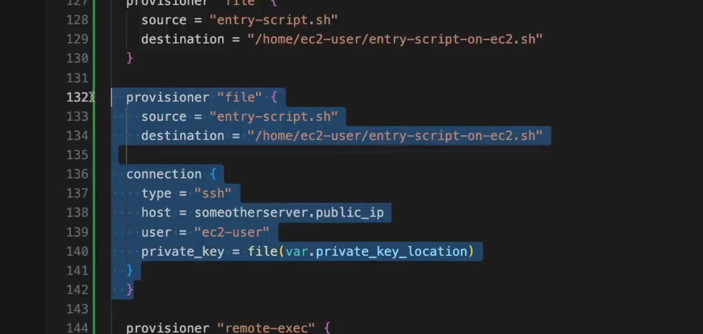
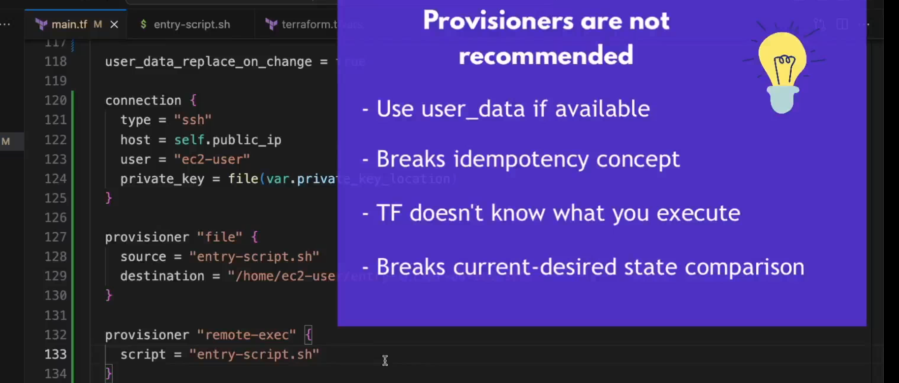

# Terraform

## Notes

### AMI ID

The AMI ID will be different based on the region you are using. The AMI ID used in this example is for the `ap-south-1` region.

### Creating SSH Key Pair for EC2 Instance on Windows

```sh
ssh-keygen -t rsa -b 4096 -C "example@gmail.com" -f "$HOME\.ssh\testing_key_pair"
```

### Security Group Port Range

- `from_port` and `to_port` in a Security Group specify the port range for which the rule is applied.

### Accessing Private Host using Bastion Host

1. Copy the private key to Bastion Host:
   ```sh
   scp -i "$HOME\.ssh\testing_key_pair" "$HOME\.ssh\testing_key_pair.pem" ec2-user@bastion-host-ip:/home/ec2-user/
   ```
2. SSH into the Bastion Host:
   ```sh
    ssh -i "$HOME\.ssh\testing_key_pair" ec2-user@bastion-host-ip
    ```
3. Change Ssh Key Permissions:
   ```sh
   chmod 400 testing_key_pair
   ```
4. SSH into the Private Host from the Bastion Host:
   ```sh
    ssh -i testing_key_pair ec2-user@private-host-ip
    ```

### How to set the credentials for terraform connecting to the AWS

1. In `main.tf` as the access_key and secret_key
   provider "aws" { 
      access_key = XXX
      secret_Key = XXX
   }

2. in terminal set the ENV variable EXPORT 
   export AWS_SECRET_ACCESS_KEY=XXX
   export AWS_ACCESS_KEY_ID=XXX

   `only the current and the present terminal`

3. seting it on the user level
   ~/.aws/credentials


4. AWS configure using aws cli (Best Way)

   aws configure 


5. Custom Terraform Enviornment Variable
   it should start with TF_VAR_<name>


   export TF_VAR_avail_zone=ap-south-1

   in `main.tf`
   variable avail_zone{}


   var.avail_zone

 
 
 
 